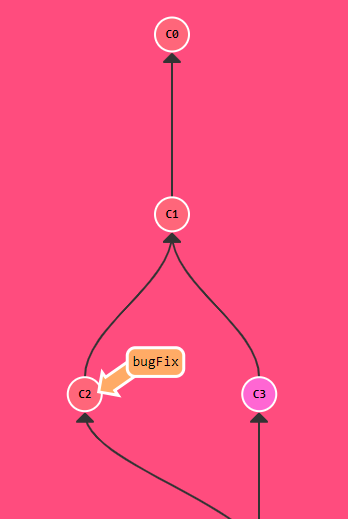

# Hướng Dẫn Dùng Git
**Hello anh em!**  

  

Tổng quan về git:  

Git dùng để quản lí mã nguồn, nó lưu trữ versions của mã code thông qua những cái log mà chúng ta đã commit và giúp dễ dàng revert khi có các code lỗi.  
  

Dùng `git init` để tạo khởi tạo git, lần commit đầu tiên tôi gọi C0 (như hình trên) Git sẽ tạo một commit đầu tiên trong lịch sử của kho lưu trữ đó. Commit này thường được gọi là "commit khởi nguyên" hoặc "commit đầu tiên". Trong Git, commit đầu tiên này thể hiện trạng thái ban đầu của dự án và chứa thông tin về thư mục và tệp tin hiện có.  
mỗi commit được đại diện bởi một nút (node) và các nút được liên kết với nhau bằng các tham chiếu (references). Mỗi commit chứa thông tin về các thay đổi trong dự án, bao gồm các tệp tin và thư mục. Các tham chiếu giúp xác định mối quan hệ giữa các commit trong lịch sử. Trong Git, không có một commit cụ thể nào được coi là "root" của lịch sử commit. Thay vào đó, mỗi commit có thể có một hoặc nhiều commit cha (parent commits) và một hoặc nhiều commit con (child commits), tạo thành một cấu trúc cây ngược (inverted tree) trong DAG. Hãy nhìn hình trên lần nữa, nếu tôi có commit c1 thì nó reference tới commit c0. mỗi commit thông thường sẽ tham chiếu đến commit cha của nó. Khi bạn tạo một commit mới (c1), commit đó sẽ lưu trữ tham chiếu đến commit cha trước đó (c0). Commit cha của một commit được xác định bởi thông tin metadata trong commit. Khi bạn tạo commit c1, Git sẽ tự động ghi nhận thông tin về commit cha (c0) và lưu trữ tham chiếu đến commit cha đó. Điều này cho phép Git theo dõi sự lịch sử của các commit và tạo ra một chuỗi các commit được liên kết với nhau theo trình tự thời gian. Thông qua các tham chiếu commit cha, Git cho phép bạn đi ngược lại trong lịch sử commit, khám phá và khôi phục các phiên bản trước đó của dự án.

__  
Một số lệnh cơ bản thường dùng bao gồm: `git init`, `git clone`, `git add`, `git commit`, `git push`, `git pull`, và `git merge`. 

## Git Flow  
  

>  

### Các commands thường hay sử dụng

_How: cách sử dụng_  

_What: nó là gì_  

_When: khi nào sử dụng_  

| Commands | How | What | When |
| --- | --- | --- | --- |
| clone | sdfsdfsdfsdfsdfsdfsdfsdf | sdfsdfsdffffffffffff | sdfsdfsdfsdfsdfs  dfsdfsdfdddddđ |
| branch | sdfsdfsfsdfsdfsdfsdf | dddddddddddddddddddddddddddd | ádasdasdasdasdasdasdasdasdasdasdasd  asdasdasdasdasdasd |
| branch | sdfsdfsfsdfsdfsdfsdf | ddddddddddddddsdddddddddddddđ  5dddddddddddddd | ádasdasdasdasdasdasdasdasdasdasdasd  asdasdasdasdasdasd |
| branch | sdfsdfsfsdfsdfsdfsdf | dddddddddddddddddddddddddddd | ádasdasdasdasdasdasdasdasdasdasdasd  asdasdasdasdasdasd |
| Cell 1 | Cell 2 | Cell 1 | Cell 2 |
| Cell 1 | Cell 2 | Cell 1 | Cell 2 |
| Cell 1 | Cell 2 | Cell 1 | Cell 2 |
  
quản lí mã
quan trọng nhất là lưu trữ versions của code thông qua những cái log mà chúng ta đã commit và giúp dễ dàng revert các code lỗi.

không nên sửa đổi file trên master

[Luyện git](https://learngitbranching.js.org/)